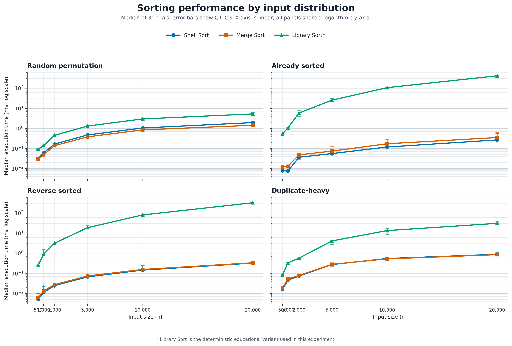
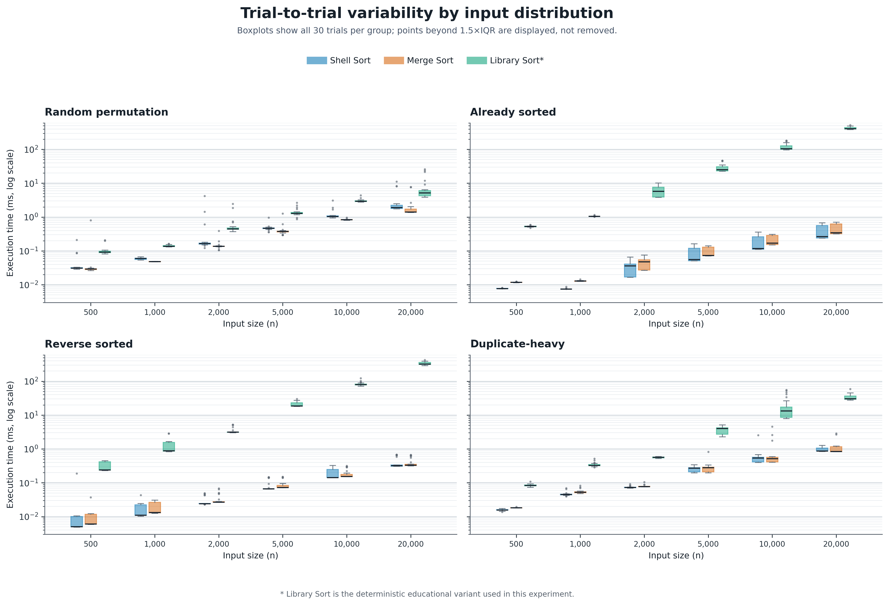

# algorithm-env

## 정렬 알고리즘 비교 과제

이 작업은 Shell Sort, Merge Sort, Library Sort의 동작과 성능을 C 구현 중심으로
비교하는 알고리즘 과제입니다. Bubble Sort는 기존 예제 알고리즘으로 함께 구현되어
있으며, benchmark 비교 대상은 Shell, Merge, Library Sort입니다. Python 구현과
테스트도 제공하지만 C와 Python의 실행 시간은 직접 비교하지 않습니다.

### 구현 및 파일 구성

| 파일 | 역할 |
| --- | --- |
| `src/sort.h`, `src/sort.c` | C 정렬 함수 인터페이스와 Bubble, Merge, Shell, Library Sort 구현 |
| `src/sort.py` | Python 정렬 알고리즘 구현 |
| `src/main.c` | C 성능 benchmark, 입력 생성, correctness 확인, CSV 출력 |
| `src/main.py` | 기존 Python 실행 및 Merge/Shell 비교 예제 |
| `tests/test_sort.c` | C 정렬 함수 테스트 |
| `tests/test_sort.py` | Python `unittest` 정렬 테스트 |
| `Makefile` | C 빌드 및 C/Python 테스트 실행 명령 |
| `report/library-sort-final.csv` | 최종 30-trial C benchmark 원자료 |

Library Sort는 AI를 활용해 알고리즘 원리를 먼저 학습한 뒤, 빈 공간에 삽입하고
필요할 때 재배치하는 원리를 보여주는 **deterministic educational variant**로
구현했습니다. 이번 구현의 관측 결과를 randomized Library Sort를 포함한 Library
Sort 전체의 성능이나 이론적 복잡도로 일반화하지 않습니다.

### 개발 및 실험

알고리즘 원리를 학습하고 구현한 다음, C와 Python unit test로 정렬 결과를 확인하고
C benchmark pilot을 실행했습니다. pilot 측정값을 분석한 뒤 timer 경계를 함수 포인터
호출만 포함하도록 정리하고 30-trial 최종 실험을 수행했습니다. 단계별 Git commit을
가정하거나 기록한 것은 아닙니다.

```sh
make test
make src/main.out
./src/main.out > report/library-sort-final.csv
```

테스트 결과는 C **24 checks, 0 failures**, Python **6 tests 통과**입니다. 최종
benchmark는 입력 크기 `500, 1000, 2000, 5000, 10000, 20000`과 네 입력 유형
`random`, `already_sorted`, `reverse_sorted`, `duplicate_heavy`를 사용했습니다.
각 `(input_size, distribution)` 조건은 30회 반복하고, 그 trial의 원본 입력을
세 알고리즘에 동일하게 복사해 전달했습니다. `qsort()`로 만든 독립 정답과
nondecreasing 순서를 검증했으며, 최종 CSV는 2,160개 측정 행을 포함합니다.

30-trial median에서 `n=20000` random 입력은 Shell 1.932ms, Merge 1.423ms,
Library 5.221ms였습니다. already-sorted 입력은 각각 0.266ms, 0.348ms,
411.088ms였고 reverse-sorted 입력은 0.322ms, 0.332ms, 321.851ms였습니다.
이 수치는 현재 실행 환경과 이번 deterministic Library Sort 변형에서 관측한
결과입니다.

### Benchmark 그래프

네 입력 유형별 30-trial median과 Q1–Q3 범위입니다. x축은 입력 크기, y축은 공통
로그 스케일이며, 세 알고리즘의 표시 방식은 모든 패널에서 동일합니다.



아래 boxplot은 각 조건의 원 측정 30개와 변동 범위를 보여줍니다. 이상값을
삭제하지 않았습니다. `Library Sort*`는 이번 과제의 deterministic educational
variant를 뜻합니다.



## Template 사용 안내

2026-2 **고급알고리즘**(SIT2001-01)의 **실습 환경 template**입니다.
컴파일러와 Python이 들어 있는 컨테이너, `src`/`tests` 뼈대, 그리고 병합 정렬과
셸 정렬, Library Sort의 실행 시간을 비교하는 예제가 들어 있습니다.

- 강의 자료: [lec-algorithm.github.io/lecture](https://lec-algorithm.github.io/lecture/)
- 강의 예제 코드: [lec-algorithm/algorithm-code](https://github.com/lec-algorithm/algorithm-code)
- 시각화 자료: [lec-algorithm/algorithm-viz](https://github.com/lec-algorithm/algorithm-viz)

## 언제 쓰나

이 저장소는 **새 저장소의 출발점**입니다. 상단의 **Use this template**을 눌러
자기 계정에 사본을 만들고 거기서 작업하세요.

- **과제**를 낼 때
- **개인프로젝트**를 시작할 때 (수업계획서상 GitHub 저장소 제출이 필수입니다)
- 알고리즘 코드를 돌려 볼 환경이 필요할 때

수업에서 다루는 예제 코드는 여기가 아니라 `algorithm-code`에 있습니다.
그쪽은 매주 새 주제가 추가되므로, 복사하지 말고 저장소에서 바로 Codespace를
만들거나 클론해서 `git pull`로 받으세요.

## 준비물

**GitHub 계정 하나면 됩니다.** 로컬에서 돌리려면 Git과 Docker가 필요합니다.
컴파일러와 Python은 컨테이너 이미지 안에 들어 있어 따로 설치하지 않습니다.

## 시작하기 (권장): Codespaces

1. 이 저장소 상단의 **Use this template** → **Create a new repository**
2. 저장소 이름을 정합니다 (예: `algorithms-hw1`, `my-algorithm-project`)
3. 만들어진 **내 저장소**에서 **Code** → **Codespaces** 탭
4. **Create codespace on main**

잠시 기다리면 브라우저에 VS Code가 뜹니다. **그 터미널이 곧 컨테이너 안**이므로
바로 아래 [돌려보기](#돌려보기)로 넘어가면 됩니다.

## 로컬에서 하기

위와 같이 **내 저장소를 먼저 만든 뒤** 그것을 클론합니다.

```sh
git clone https://github.com/<본인 계정>/<내 저장소>.git
cd <내 저장소>
docker compose up -d
docker compose exec lab bash
```

처음 한 번은 이미지를 받느라 몇 분 걸립니다. 이후에는 몇 초면 뜹니다.
**이후 모든 `docker compose` 명령은 이 폴더에서 칩니다.**

VS Code를 쓴다면 Dev Containers 확장의 **Reopen in Container**를 골라도
됩니다. Codespaces와 같은 설정을 씁니다.

## 돌려보기

컨테이너 안에서 `make` 한 단어면 됩니다.

- 실행

```sh
make run
```

- 결과

```console
algorithm,input_size,distribution,trial,seed,elapsed_time_ns,correct
shell,500,random,1,...,...,1
merge,500,random,1,...,...,1
library,500,random,1,...,...,1
...
```

C benchmark는 조건별 입력을 세 알고리즘에 공통으로 제공하고 결과를 검증합니다.
시간은 실행 환경에 따라 달라지며, C와 Python의 측정값은 서로 직접 비교하지
않습니다. `make run`은 C benchmark 뒤에 Python 예제도 실행합니다.

## 테스트

- 실행

```sh
make test
```

- 결과

```console
ok    섞인 배열 (merge sort)
ok    섞인 배열 (shell sort)
...

24 checks, 0 failures
...
Ran 6 tests in 0.001s

OK
```

테스트가 하나라도 실패하면 `make`가 0이 아닌 코드로 끝납니다. 과제를 내기
전에 이 명령이 통과하는지 확인하세요.

| 명령 | 하는 일 |
| --- | --- |
| `make run` | 예제 실행 (C · Python) |
| `make test` | 유닛 테스트 (C · Python) |
| `make run-c` · `make run-py` | 한쪽만 실행 |
| `make test-c` · `make test-py` | 한쪽만 테스트 |
| `make debug` | 디버그 심볼을 넣어 빌드 |
| `make clean` | 빌드 산출물 정리 |

## VS Code에서 실행·디버그

Codespaces나 Dev Containers로 열었다면 편집기에서 바로 됩니다.

| 하고 싶은 것 | 방법 |
| --- | --- |
| 파일 하나 실행 | 편집기 오른쪽 위 **▶ 버튼** (Code Runner) |
| 전체 실행 | `Cmd/Ctrl + Shift + B` (기본 빌드 작업이 `make run`) |
| 테스트 | 명령 팔레트 → **Tasks: Run Test Task** |
| C 디버그 | `F5` → **C 디버그 (현재 파일)** |
| Python 디버그 | `F5` → **Python 디버그 (현재 파일)** |

`F5`를 누르면 빌드가 먼저 돌아 심볼이 있는 바이너리를 만들고 디버거가
붙습니다. 중단점을 걸고 변수를 들여다볼 수 있습니다.

### 파일 하나만 실행·디버그하기

**C 디버그 (현재 파일)**은 열려 있는 `.c` 파일을 그대로 디버깅합니다. 폴더가
늘어나도 구성을 새로 만들 필요가 없습니다.

같은 폴더의 `.c`를 함께 링크하므로, 구현이 옆 파일에 있어도 됩니다. 대신
**한 폴더에 `main`은 하나만** 두세요.

터미널에서 직접 부를 수도 있습니다.

```sh
make src/main.debug.out && ./src/main.debug.out
```

### ▶ 버튼에 대해

편집기 오른쪽 위의 ▶ 버튼은 **Code Runner** 확장이 제공합니다. C든 Python이든
열려 있는 파일을 그대로 실행합니다.

두 확장이 각각 ▶ 버튼을 내놓으면 헷갈리므로, C/C++ 확장 쪽은 꺼 두었습니다
(`C_Cpp.debugShortcut`). 그쪽 버튼은 **파일 하나만** 컴파일해서 이런 오류를
냅니다.

```console
undefined reference to `bubbleSort'
collect2: error: ld returned 1 exit status
```

Code Runner도 기본 설정 그대로면 같은 문제가 나고, Python은 이미지에 없는
`python`을 찾습니다. 그래서 `.vscode/settings.json`에서 두 가지를 고쳐
두었습니다.

- C는 `Makefile`의 `%.out` 규칙을 거쳐 **같은 폴더의 `.c`를 함께** 빌드합니다
- Python은 `python3`로 실행합니다
- 출력 패널이 아니라 **터미널**에서 돌립니다. 그래야 `scanf`나 `input()`이 멈추지 않습니다

## 저장소 구조

```plaintext
algorithm-env/
├── .devcontainer/devcontainer.json  # Codespaces · Dev Containers 설정
├── compose.yml                      # 실습 컨테이너 (서비스 이름: lab)
├── Dockerfile                       # gcc · gdb · make · python3 · git
├── .vscode/                         # 빌드·디버그 설정 (F5, Cmd+Shift+B)
├── Makefile                         # run · test · debug · clean
├── src/
│   ├── sort.h · sort.c              # C 구현
│   ├── main.c                       # C 실행 예제
│   ├── sort.py                      # Python 구현
│   └── main.py                      # Python 실행 예제
└── tests/
    ├── test_sort.c                  # C 유닛 테스트 (표준 C만 사용)
    └── test_sort.py                 # Python 유닛 테스트 (unittest)
```

## 규약

- **실행 파일은 `*.out`으로 만듭니다.** `.gitignore`가 `*.out`만 걸러내므로,
  컨테이너에서 컴파일한 Linux 바이너리가 커밋에 섞이지 않습니다.
- **외부 라이브러리를 쓰지 않습니다.** C는 표준 라이브러리만, Python은 표준
  모듈만 씁니다. C 테스트도 프레임워크 없이 `assert` 수준으로 직접 씁니다.
- **C와 Python은 같은 알고리즘을 같은 이름의 함수로 구현합니다.** 언어 차이가
  알고리즘 차이로 보이지 않게 합니다.
- 파일명은 각 언어의 관례를 따릅니다. C는 camelCase(`bubbleSort`), Python은
  snake_case(`bubble_sort`)입니다.

## 자기 코드로 바꾸기

`src`의 버블 정렬은 환경이 도는지 보여 주는 예제일 뿐입니다. 지우고 자기
코드를 넣으세요. `tests`도 마찬가지입니다. 뼈대(`Makefile`, `src`, `tests`,
컨테이너 설정)만 남기면 됩니다.

## 변경 기록

버전과 변경 내역은 [CHANGELOG.md](CHANGELOG.md)에 있습니다.

## 정리

```sh
docker compose down
```

컨테이너를 지워도 코드는 그대로 남습니다.
